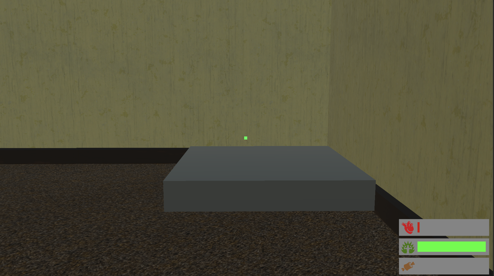
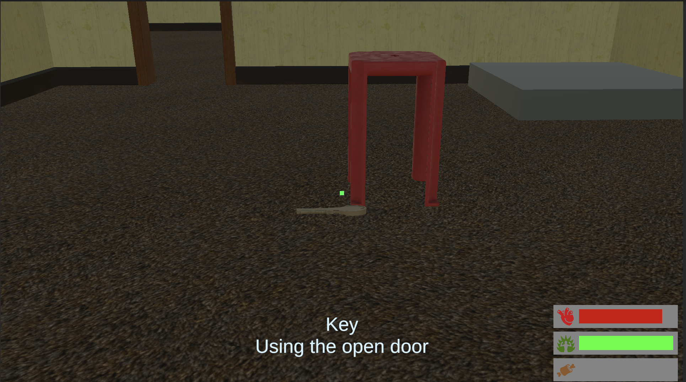
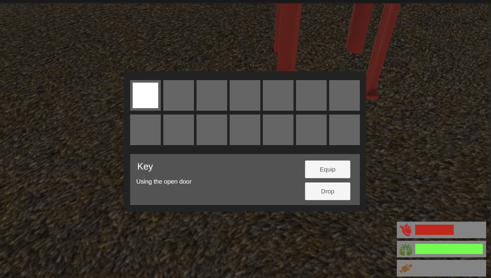
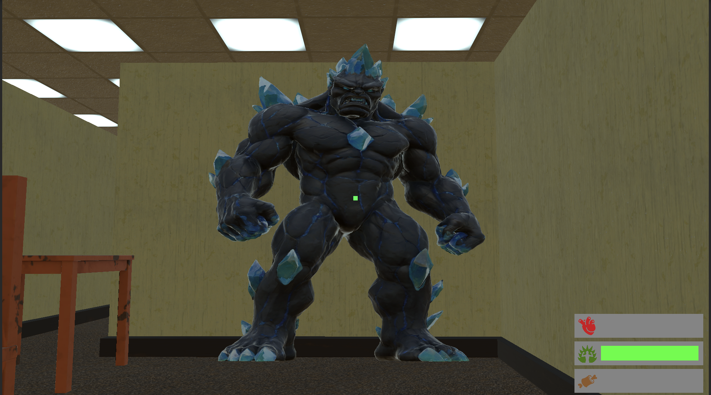

# 백룸

## 기능 구현 내용
(필수 과제만 추가)  (99프로 구현, 아이템 사용 미구현)
- **기본 이동 및 점프 `Input System`, `Rigidbody ForceMode`** (난이도 : ★★☆☆☆)
    - 플레이어의 이동(WASD), 점프(Space) 등을 설정

- **체력바 UI `UI`** (난이도 : ★★☆☆☆)
    - UI 캔버스에 체력바를 추가하고 플레이어의 체력을 나타내도록 설정
    - 플레이어의 체력이 변할 때마다 UI 갱신

- **동적 환경 조사 `Raycast`, `UI`** (난이도 : ★★★☆☆)
    - Raycast를 통해 플레이어가 조사하는 오브젝트의 정보를 UI에 표시
    - 예) 플레이어가 바라보는 오브젝트의 이름, 설명 등을 화면에 표시

- **점프대 `Rigidbody ForceMode`** (난이도 : ★★★☆☆)
    - 캐릭터가 밟을 때 위로 높이 튀어 오르는 점프대 구현
    - **OnCollisionEnter** 이벤트를 사용해 캐릭터가 점프대에 닿았을 때 **ForceMode.Impulse**를 사용해 순간적인 힘을 가함

- **아이템 데이터 `ScriptableObject`** (난이도 : ★★★☆☆)
    - 다양한 아이템 데이터를 `ScriptableObject`로 정의
    - 각 아이템의 이름, 설명, 속성 등을 `ScriptableObject`로 관리

- **아이템 사용 `Coroutine`** (난이도 : ★★★☆☆)
    - 특정 아이템 사용 후 효과가 일정 시간 동안 지속되는 시스템 구현
    - 예) 아이템 사용 후 일정 시간 동안 스피드 부스트

## 스크린샷
> 

점프대 구현

아이템 상호작용

인벤토리 기능

쓸데없는 몬스터
TMI: 맵을 만들기전에 3D 모델로 새로운 몬스터를 만들어보고 싶어서 Blender라는 웹 유튜브 강의를 듣다가 만들기엔 무리라서 AI를 활용.
나중에 AI Navigation을 추가하려고 미리 넣어놨지만 시간 관계상 그 기능은 무리라서 그냥 맵에 둬버림.